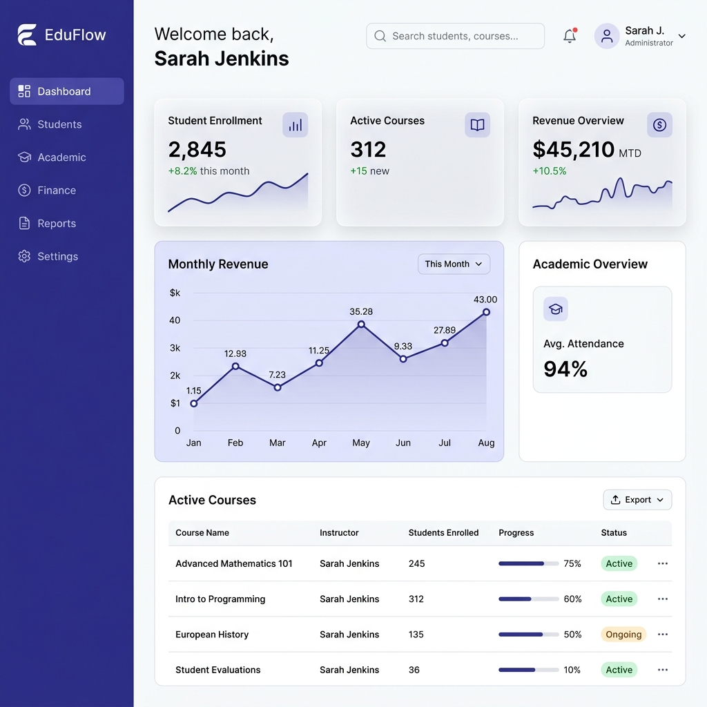

# 🦅 EduFlow - Premium Educational SaaS

EduFlow es una plataforma de gestión académica y administrativa de alto rendimiento, diseñada para instituciones educativas modernas. Inspirada en la robustez de Q10 pero elevada con una estética **"Flat Premium"** y un stack tecnológico de vanguardia.

## 🚀 Características Principales

*   **Arquitectura Multi-tenant**: Diseñado para escalar a múltiples instituciones con aislamiento de datos total.
*   **Gestión Académica Integral**: Control total sobre programas, cursos, secciones y calendarios.
*   **Finanzas y Tesorería**: Automatización de facturación, recaudación y estados de cuenta en tiempo real.
*   **Experiencia de Usuario (UX)**: Interfaz fluida basada en Next.js 15, Tailwind CSS v4 y Framer Motion.
*   **Seguridad**: Autenticación robusta con Better Auth y Prisma para una integridad de datos superior.

## 🛠️ Tech Stack

*   **Frontend**: Next.js 15 (App Router), React 19, Tailwind CSS v4.
*   **Backend**: Prisma ORM, Better Auth.
*   **Diseño**: Framer Motion, GSAP, Lucide Icons.
*   **Infraestructura**: Monorepo compatible, listo para despliegue en Vercel/Railway.

## 📦 Instalación y Desarrollo

1.  Clonar el repositorio.
2.  Instalar dependencias: `pnpm install`.
3.  Configurar variables de entorno en `.env`.
4.  Ejecutar el servidor de desarrollo: `pnpm dev`.

## 🌐 Despliegue en Vivo

Puedes visualizar la aplicación funcionando en el siguiente enlace:
[**EduFlow Live Demo**](https://eduflow-platform.vercel.app)

---
*Desarrollado con ❤️ por Sebastian H. y Antigravity AI.*
